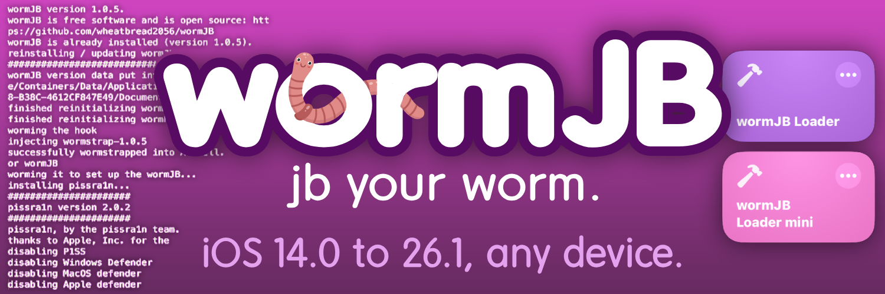

wormJB is a jailbreak-like tool for iOS that supports versions 14.0 to 26.1 with any device.

wormJB has only been tested on iOS 26.0.1 with the iPhone 15, in both A-Shell and A-Shell Mini. If any issues arise, you can report an issue.

*disclaimer: this is not a jailbreak, and does not exploit anything in iOS. the project is purely for entertainment and experimental purposes.*

## Requirements
- an Internet Connection
- an Apple device running iOS/iPadOS 14.0 or later
- the [A-Shell App](https://apps.apple.com/us/app/a-shell/id1473805438) or [A-Shell Mini](https://apps.apple.com/us/app/a-shell-mini/id1543537943) (i recommend A-Shell mini as it is much smaller and works the same for wormJB)
- the **Shortcut**

**Download the shortcut that corresponds to your A-Shell app. If you have A-Shell Mini instead of A-Shell, get the shortcut that says A-Shell mini.**

[Shortcut (A-Shell)](https://www.icloud.com/shortcuts/24ed0aa0e2b14f90807c950a97e44223)

[Shortcut (A-Shell mini)](https://www.icloud.com/shortcuts/339325fa3ac14a2f83b5f8507c61a8ee)

## Instructions
1. Download the Shortcut if you haven't already, along with installing A-Shell.
2. Run the Shortcut. You should click "Yes" on the first prompt unless you have not installed A-Shell.

That's it! Now wormJB should do its magic.

## How it Works
The **liquidra1n 2** tool is used. This is essential for wormJB.

After this, the **semi-rootless environment** will be prepared by the wormJB scripts.

## FAQ
**Q**: Is wormJB rootful?

**A**: wormJB is only a **semi-rootless** jailbreak-like tool. This means that you are stuck inside A-Shell for filesystem operations, and cannot access / but rather a simulation of it (directories copied) inside your user directory: ~/Documents

---

**Q**: wormJB did not install.

**A**: Rerun the shortcut.

---

**Q**: I can't install A-Shell from the App Store. What do I do?

**A**: Then your device cannot be wormJBed.

## Inspiration

wormJB was inspired by:
- [pissra1n](https://github.com/bomberfish/pissra1n)
- [Ballpa1n](https://github.com/llsc12/ballpa1n)
- [hammerJB](https://github.com/WhitetailAni/hammerJB)

## Legal Info

iOS is a trademark of Apple, Inc.

No exploits that harm the security of iOS are included with this repository.
